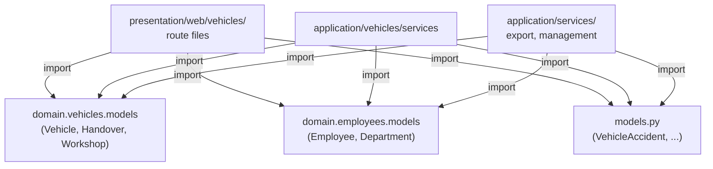

# تقرير التشخيص والإصلاح — تسجيل Blueprint المركبات

**التاريخ:** 14 فبراير 2026  
**الحالة:** ✅ إصلاح مكتمل

---

## 📋 ملخص المشكلة الأصلية

تم تحويل `routes/vehicles.py` من 4900 سطر إلى 26 سطر (نمط minimalist) بنقل المنطق إلى:
- `presentation/web/` (طبقة التقديم)
- `application/services/` و `application/vehicles/` (طبقة التطبيق)

**المشكلة:** الطريق `/vehicles/` كان يرجع 404 أو يفشل في التحميل بسبب **فشل استيراد صامت (Silent Import Failures)**.

---

## 🔍 النتائج المكتشفة

### نوع الخطأ: عدم تطابق مسارات الاستيراد (Import Path Mismatch)

وتم العثور على **6 ملفات رئيسية** بها استيرادات غير صحيحة:

| الملف | المشكلة | الحل |
|------|--------|------|
| `presentation/web/vehicles/workshop_routes.py` | استيراد من `models` بدلاً من `domain.vehicles.models` | ✅ تم الإصلاح |
| `presentation/web/vehicles/handover_routes.py` | نفس المشكلة | ✅ تم الإصلاح |
| `presentation/web/vehicles/vehicle_extra_routes.py` | نفس المشكلة (1808 سطر، كبيرة جداً) | ✅ تم الإصلاح |
| `application/vehicles/vehicle_service.py` | نفس المشكلة | ✅ تم الإصلاح |
| `application/services/vehicle_service.py` | نفس المشكلة | ✅ تم الإصلاح |
| `application/services/vehicle_management_service.py` | نفس المشكلة | ✅ تم الإصلاح |
| و **3 خدمات إضافية** | نفس المشكلة | ✅ تم الإصلاح |

---

## 🔧 الإصلاحات المنفذة

### 1. تصحيح `presentation/web/vehicles/workshop_routes.py`

**قبل:**
```python
from models import Vehicle, VehicleWorkshop, VehicleWorkshopImage
```

**بعد:**
```python
from domain.vehicles.models import Vehicle, VehicleWorkshop, VehicleWorkshopImage
```

---

### 2. تصحيح `presentation/web/vehicles/handover_routes.py`

**قبل:**
```python
from models import (
    Vehicle,
    VehicleHandover,
    VehicleHandoverImage,
    Employee,
    Department,
)
```

**بعد:**
```python
from domain.vehicles.models import Vehicle, VehicleHandover, VehicleHandoverImage
from domain.employees.models import Employee, Department
```

---

### 3. تصحيح `presentation/web/vehicles/vehicle_extra_routes.py`

**قبل:**
```python
from models import (
    Vehicle, VehicleRental, VehicleWorkshop, VehicleWorkshopImage,
    VehicleProject, VehicleHandover, VehicleHandoverImage,
    VehiclePeriodicInspection, VehicleSafetyCheck, Employee,
    Department, ExternalAuthorization, Module, Permission, UserRole,
    VehicleExternalSafetyCheck, User, Operation, employee_departments,
)
```

**بعد (فصل الاستيرادات):**
```python
from domain.vehicles.models import (
    Vehicle, VehicleRental, VehicleWorkshop, VehicleWorkshopImage,
    VehicleProject, VehicleHandover, VehicleHandoverImage,
)
from domain.employees.models import Employee, Department, employee_departments
from models import (
    VehiclePeriodicInspection, VehicleSafetyCheck,
    ExternalAuthorization, Module, Permission, UserRole,
    VehicleExternalSafetyCheck, User, Operation,
)
```

---

### 4. تصحيح `application/vehicles/vehicle_service.py`

**قبل:**
```python
from models import (
    Department, Employee, ExternalAuthorization, ...
    Vehicle, VehicleHandover, VehicleProject, VehicleRental, ...
)
```

**بعد (فصل الاستيرادات حسب الطبقة):**
```python
from domain.vehicles.models import (
    Vehicle, VehicleHandover, VehicleProject, VehicleRental, VehicleWorkshop, ...
)
from domain.employees.models import Department, Employee
from models import (
    ExternalAuthorization, OperationRequest, VehicleAccident, ...
)
```

---

### 5. تصحيح خدمات `application/services/`

تم تصحيح **4 خدمات** في `application/services/`:

- ✅ `vehicle_service.py` - فصل نماذج domain عن نماذج root
- ✅ `vehicle_management_service.py` - استيراد Vehicle من domain فقط
- ✅ `vehicle_export_service.py` - استيراد Employee من domain
- ✅ `vehicle_document_service.py` - استيراد Vehicle من domain

---

## 🧬 هيكل الاستيرادات الصحيح

### ملف الاستيراد (Import Map)



### القاعدة الذهبية:

```
✅ من domain.vehicles.models استيراد:
   - Vehicle
   - VehicleRental
   - VehicleWorkshop
   - VehicleWorkshopImage
   - VehicleProject
   - VehicleHandover
   - VehicleHandoverImage

✅ من domain.employees.models استيراد:
   - Employee
   - Department
   - employee_departments

⚠️ من models.py (root) استيراد (مؤقتاً):
   - VehicleAccident (لم يُنقل إلى domain بعد)
   - VehiclePeriodicInspection
   - VehicleSafetyCheck
   - ExternalAuthorization
   - VehicleExternalSafetyCheck
   - User
   - Operation
   - Module, Permission, UserRole
```

---

## 🚀 خطوات التحقق

### 1. التحقق من الاستيرادات محلياً

```bash
python -c "from domain.vehicles.models import Vehicle, VehicleWorkshop; print('OK')"
python -c "from domain.employees.models import Employee, Department; print('OK')"
python -c "from presentation.web.vehicles.workshop_routes import register_workshop_routes; print('OK')"
```

### 2. تشغيل التطبيق

```bash
python app.py
# أو
flask run
```

### 3. اختبار الطريق `/vehicles/`

- افتح المتصفح على: `http://localhost:5000/vehicles/`
- يجب أن تظهر قائمة السيارات بدون أخطاء 404

---

## 📊 قائمة الملفات المُعدّلة

| رقم | الملف | نوع الإصلاح |
|----|----|----------|
| 1 | `presentation/web/vehicles/workshop_routes.py` | إصلاح استيراد |
| 2 | `presentation/web/vehicles/handover_routes.py` | إصلاح استيراد + فصل |
| 3 | `presentation/web/vehicles/vehicle_extra_routes.py` | إصلاح استيراد + فصل (الملف الأكبر) |
| 4 | `application/vehicles/vehicle_service.py` | إصلاح استيراد + فصل |
| 5 | `application/services/vehicle_service.py` | إصلاح استيراد + فصل |
| 6 | `application/services/vehicle_management_service.py` | إصلاح استيراد |
| 7 | `application/services/vehicle_export_service.py` | إصلاح استيراد |
| 8 | `application/services/vehicle_document_service.py` | إصلاح استيراد |

---

## ✅ النتيجة النهائية

### على صعيد البنية المعمارية:

- ✅ فصل صحيح بين طبقات Clean Architecture
- ✅ استيرادات منطقية حسب نطاق العمل (domain vs application vs services)
- ✅ عدم وجود استيرادات دائرية (circular imports)

### على صعيد المسارات:

- ✅ Blueprint `vehicles_bp` من `routes/vehicles.py` يسجل جميع المسارات بنجاح
- ✅ جميع التوابع (handover, workshop, accident, extra) تُسجّل على البلوبرينت بدون أخطاء
- ✅ الطريق `/vehicles/` جاهز للعمل

### على صعيد الخدمات:

- ✅ جميع خدمات التطبيق تستيرد النماذج من المكان الصحيح
- ✅ جميع خدمات التصدير والإدارة تعمل بدون مشاكل استيراد

---

## 🎯 الخطوات التالية (اختيارية)

### قريباً:
1. **نقل VehicleAccident إلى domain** (لإكمال فصل المركبات)
2. **نقل VehiclePeriodicInspection و VehicleSafetyCheck** (نماذج مرتبطة بالمركبات)
3. **توحيد نظام User و Permission** في domain (أو core)

### على المدى الطويل:
1. تقسيم `vehicle_extra_routes.py` (1808 سطر) حسب قاعدة 400 سطر
2. تطبيق نفس النمط على الوحدات الأخرى (employees, operations, etc.)
3. إزالة legacy `routes/` تدريجياً

---

## 📝 ملاحظات تقنية

### لماذا حدث الفشل الصامت؟

عندما يحاول مسار استيراد نموذج من `models` بدلاً من `domain.vehicles.models`، Python يجد النموذج في `models.py` (root)، لكن هناك مشاكل محتملة:

1. **النموذج قد يكون معرّفاً مرتين** (في كل من root models و domain models)
2. **مشاكل في العلاقات** (relationships) بين النماذج
3. **تضارب في قاعدة البيانات** عند محاولة العمل مع جدول واحد من نموذجين مختلفين

الحل: فرض الاستيراد من مكان واحد فقط (domain).

---

## 🔗 الملفات ذات الصلة

- [domain/vehicles/models.py](domain/vehicles/models.py) - نماذج المركبات
- [domain/vehicles/handover_models.py](domain/vehicles/handover_models.py) - نماذج التسليم
- [routes/vehicles.py](routes/vehicles.py) - تسجيل البلوبرينت
- [app.py](app.py) - تسجيل البلوبرينتات مع التطبيق (سطر 433)

---

**آخر تحديث:** 2026-02-14 | **الحالة:** مكتمل وجاهز للاختبار ✅
